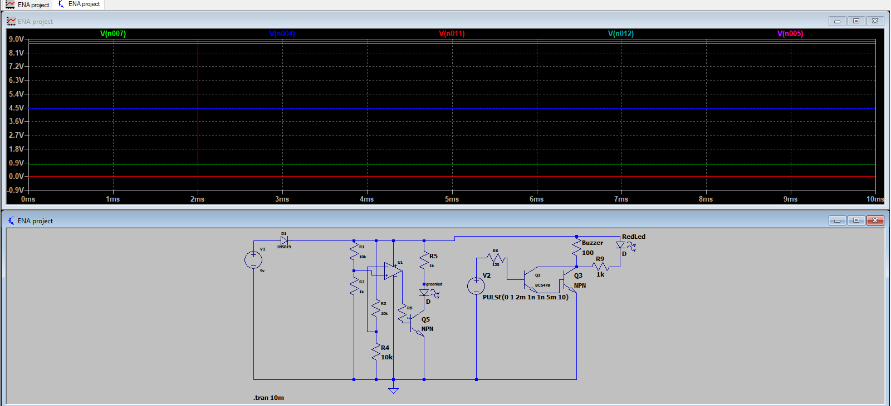
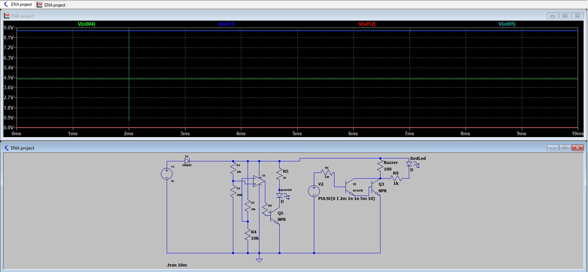

# Transistor-Based Light Detector & Touch Sensor System

This is a hardware-based electronics project developed as part of my practical electrical engineering coursework at NUST. It demonstrates the application of Bipolar Junction Transistors (BJTs) acting as electronic switches and amplifiers.

## 💡 Project Breakdown & Core Logic

### 1. Light Detector Circuit
* **How it Works:** This circuit automatically detects the presence or absence of ambient light. It utilizes a Light Dependent Resistor (LDR) whose resistance changes with light intensity, shifting the base voltage of the transistor to turn an LED/load ON or OFF.
* **Application:** Automatic streetlights, smart energy-saving systems.

### 2. Touch Sensor Circuit
* **How it Works:** An ultra-sensitive touch-switch that activates with human skin contact. It leverages the high current gain of transistors in a specific configuration, where even the tiny stray current from a finger touch is enough to bias the transistor into saturation.

---

## 🛠️ Hardware Component Specifications
To ensure accuracy and stability, the project was engineered using the following precise components:
* **Active Devices:** BC547 NPN Transistors (used for switching and amplification)
* **Resistors:** 120k $\Omega$ biasing resistors (strategically chosen for optimal base current limitation and sensitivity tuning)
* **Sensors:** Light Dependent Resistor (LDR) & Touch Plates
* **Power & Indicators:** LEDs, Breadboard, Connecting Wires, and a DC Power Source.

---

## 📂 Project Deliverables & Media

## 📊 Circuit Simulations

### 1. Light Detector Simulation

### 2. Touch Sensor Simulation

